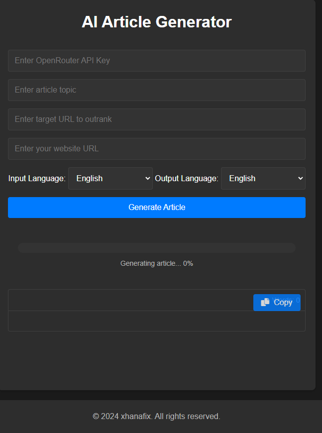

# AI Article Generator

A powerful web-based tool that generates SEO-optimized articles using the OpenRouter API with Hermes LLM. This tool helps content creators and SEO professionals generate high-quality, unique articles with proper keyword optimization and structure.

## Features

- 🤖 Powered by Hermes 3 LLM through OpenRouter API
- ✍️ Generates 2000-word SEO-optimized articles
- 🎯 Automatic focus keyword generation and implementation
- 🌐 Supports both English and Bahasa Malaysia
- 📊 Real-time word count with visual feedback
- 📱 Responsive dark theme design
- 📋 One-click copy functionality
- 🔄 Progress tracking during generation
- 🎨 Modern, user-friendly interface

## SEO Optimization Features

- Generates focus keywords automatically
- Creates SEO-friendly titles within 60 characters
- Generates optimized meta descriptions
- Creates SEO-friendly slugs
- Includes alt text suggestions for images
- Structures content with H1-H4 headings
- Implements natural keyword placement

## Getting Started

### Prerequisites

- An OpenRouter API key (get it from [OpenRouter](https://openrouter.ai/))
- A modern web browser
- Basic understanding of SEO concepts

### Installation

1. Clone the repository: 